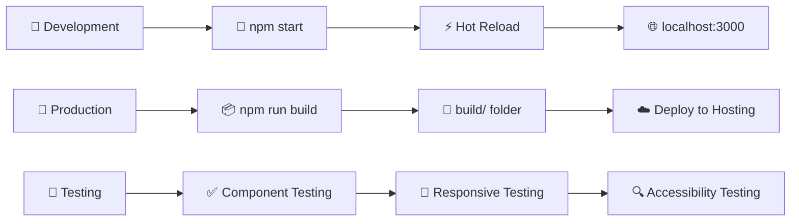

# 🏗️ Ankur Surothia Portfolio - Project Architecture

## 📁 Clean Project Structure

```
ankursurothia.portfolio/
├── 📂 public/
│   ├── 🌐 index.html              # Main HTML template
│   ├── 🎭 favicon.ico             # Site favicon
│   ├── 📱 manifest.json           # PWA manifest
│   └── 🤖 robots.txt              # SEO robots file
│
├── 📂 src/
│   ├── 📂 components/             # React Components
│   │   ├── 🧭 Navigation.jsx + .css        # Sticky navigation
│   │   ├── 👤 ProfileHeader.jsx + .css      # Profile intro section
│   │   ├── 📄 ResumeSection.jsx + .css      # Experience/Skills tabs
│   │   ├── 💼 PortfolioSection.jsx + .css   # GitHub projects
│   │   ├── 💬 TestimonialsSection.jsx + .css # Client testimonials
│   │   ├── 📝 BlogSection.jsx + .css        # Articles/Blog posts
│   │   ├── 📞 ContactSection.jsx + .css     # Contact information
│   │   ├── 🐛 BugHuntGame.jsx + .css        # Interactive Easter egg game
│   │   ├── ⬇️ DownloadResumeButton.jsx      # Resume download
│   │   ├── ⏳ LoadingStates.jsx + .css      # Loading components
│   │   └── 🔍 SEOHead.jsx                   # SEO meta tags
│   │
│   ├── 📂 assets/                 # Static Assets
│   │   ├── 📸 profile.jpg         # Profile photo
│   │   └── 📋 ankur_resume.pdf    # Resume PDF
│   │
│   ├── 🚀 App.jsx                 # Main application component
│   ├── 🎨 App.css                 # Global application styles
│   ├── 🎨 styles.css              # Additional global styles
│   ├── 🎨 index.css               # Base/reset styles
│   ├── 🔧 index.js                # React entry point
│   └── 📊 reportWebVitals.js      # Performance monitoring
│
├── 📦 package.json                # Dependencies & scripts
├── 🔒 package-lock.json           # Locked dependencies
├── 🙈 .gitignore                  # Git ignore rules
└── 📖 README.md                   # Project documentation
```

## 🔄 Component Call Flow Architecture

```mermaid
graph TB
    %% Entry Point
    A[index.js] --> B[App.jsx]
    
    %% App State Management
    B --> B1[Theme State: 'vibrant']
    B --> B2[Loading State: true → false]
    
    %% Main App Structure
    B --> C1[🧭 Navigation]
    B --> C2[⏳ PageLoader]
    B --> C3[🔗 Social Links SVG]
    B --> C4[⬇️ DownloadResumeButton]
    B --> C5[📦 Main Container]
    
    %% Portfolio Sections (Sequential Flow)
    C5 --> D1[👤 ProfileHeader]
    C5 --> D2[📄 ResumeSection]  
    C5 --> D3[💼 PortfolioSection]
    C5 --> D4[💬 TestimonialsSection]
    C5 --> D5[📝 BlogSection]
    C5 --> D6[📞 ContactSection]
    C5 --> D7[🐛 BugHuntGame]
    
    %% Interactive Features
    D2 --> E1[📑 Tab System]
    E1 --> E1A[💼 Experience]
    E1 --> E1B[🎓 Education] 
    E1 --> E1C[🏆 Certifications]
    E1 --> E1D[⚡ Skills]
    
    D3 --> E2[🎯 Project Cards Grid]
    E2 --> E2A[GitHub Integration]
    E2 --> E2B[Live Demo Links]
    E2 --> E2C[Tech Stack Tags]
    
    D4 --> E3[🎠 Testimonial Carousel]
    E3 --> E3A[Auto-rotation Timer]
    E3 --> E3B[Manual Navigation]
    
    D5 --> E4[📰 Article Cards]
    E4 --> E4A[Medium Integration]
    E4 --> E4B[External Links]
    
    D6 --> E5[📬 Contact Grid]
    E5 --> E5A[📋 Copy to Clipboard]
    E5 --> E5B[🔗 Social Links]
    E5 --> E5C[💌 Call-to-Action]
    
    D7 --> E6[🎮 Bug Hunt Logic]
    E6 --> E6A[🎯 Click Trigger]
    E6 --> E6B[🐛 Bug Spawning]
    E6 --> E6C[⏱️ Timer System]
    E6 --> E6D[🏆 Score Tracking]
    
    %% Styling Architecture
    F1[🎨 Global Styles] --> F1A[index.css]
    F1 --> F1B[App.css]
    F1 --> F1C[styles.css]
    
    F2[🎭 Component Styles] --> F2A[Navigation.css]
    F2 --> F2B[ProfileHeader.css]
    F2 --> F2C[ResumeSection.css]
    F2 --> F2D[PortfolioSection.css]
    F2 --> F2E[TestimonialsSection.css]
    F2 --> F2F[BlogSection.css]
    F2 --> F2G[ContactSection.css]
    F2 --> F2H[BugHuntGame.css]
    F2 --> F2I[LoadingStates.css]
    
    %% Assets Flow
    G1[📂 Assets] --> G1A[profile.jpg → ProfileHeader]
    G1 --> G1B[ankur_resume.pdf → DownloadButton]
    
    %% SEO & Performance
    H1[🔍 SEO] --> H1A[Meta Tags in App.jsx]
    H1 --> H1B[manifest.json]
    H1 --> H1C[robots.txt]
    
    H2[⚡ Performance] --> H2A[reportWebVitals.js]
    H2 --> H2B[Loading States]
    H2 --> H2C[Code Splitting Ready]
    
    %% Styling Classes
    classDef entry fill:#ff6b6b,stroke:#cc5555,stroke-width:3px,color:#fff
    classDef main fill:#4ecdc4,stroke:#3da49b,stroke-width:2px,color:#fff
    classDef section fill:#45b7d1,stroke:#3498db,stroke-width:2px,color:#fff
    classDef feature fill:#96ceb4,stroke:#7fb069,stroke-width:2px,color:#fff
    classDef asset fill:#feca57,stroke:#ff9f43,stroke-width:2px,color:#fff
    classDef style fill:#ff9ff3,stroke:#f368e0,stroke-width:2px,color:#fff
    
    class A,B entry
    class C1,C2,C3,C4,C5 main
    class D1,D2,D3,D4,D5,D6,D7 section
    class E1,E2,E3,E4,E5,E6,E1A,E1B,E1C,E1D,E2A,E2B,E2C,E3A,E3B,E4A,E4B,E5A,E5B,E5C,E6A,E6B,E6C,E6D feature
    class G1,G1A,G1B,H1,H1A,H1B,H1C,H2,H2A,H2B,H2C asset
    class F1,F2,F1A,F1B,F1C,F2A,F2B,F2C,F2D,F2E,F2F,F2G,F2H,F2I style
```

## 🎯 Key Architecture Decisions

### ✅ **Component Organization**
- **Modular Design**: Each section is a separate component with its own CSS
- **Single Responsibility**: Each component handles one specific portfolio section
- **Reusable Components**: LoadingStates, Navigation can be reused
- **Clean Imports**: All components imported in App.jsx for clear dependency tree

### ✅ **State Management**
- **React Hooks**: useState for theme and loading states
- **Local State**: Each component manages its own interactive state
- **No External State Library**: Keeps bundle size small for portfolio use case

### ✅ **Styling Strategy**
- **CSS Modules Pattern**: Component-specific CSS files
- **Global Styles**: App.css for theme variables and global styles
- **Responsive Design**: Mobile-first approach with media queries
- **Modern CSS**: Flexbox, Grid, Custom Properties, Animations

### ✅ **Performance Optimizations**
- **Loading States**: Smooth UX with PageLoader
- **Optimized Assets**: SVG icons instead of PNG images
- **Minimal Dependencies**: Only essential React packages
- **Clean Bundle**: Removed unused files and dependencies

### ✅ **User Experience**
- **Progressive Disclosure**: Sections load smoothly with animations
- **Interactive Elements**: Hover effects, click animations, smooth scrolling
- **Accessibility**: ARIA labels, semantic HTML, keyboard navigation
- **Professional Polish**: Consistent spacing, typography, color scheme

### ✅ **SEO & Discoverability**
- **Meta Tags**: Dynamic title and description
- **Semantic HTML**: Proper section tags with IDs
- **Social Media Ready**: Open Graph meta tags
- **Search Engine Friendly**: Clean URLs and structure

## 🚀 Build & Deployment Flow



## 📊 Performance Metrics

- **Bundle Size**: Optimized with minimal dependencies
- **Load Time**: Fast initial load with loading states
- **Interactive Elements**: Smooth animations and transitions  
- **Mobile Performance**: Responsive design with mobile-first approach
- **SEO Score**: Optimized meta tags and semantic HTML

---

*This architecture provides a scalable, maintainable, and professional portfolio structure that showcases both technical skills and attention to detail.*